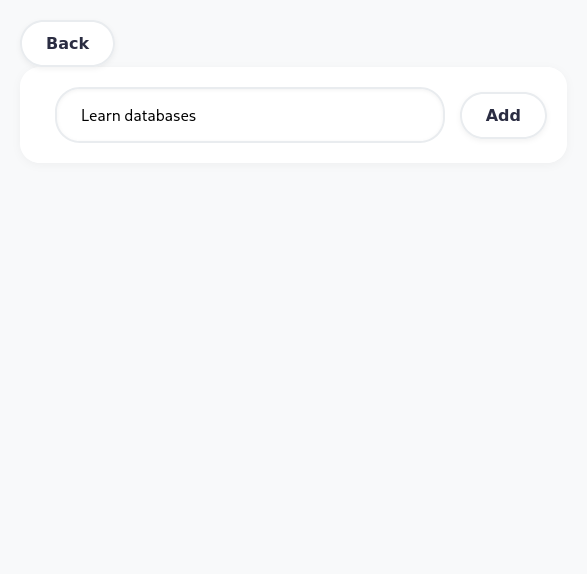

# Simple Todo App Using React

This is a practice project made with react. You can add, delete, and mark tasks.

[Live Site](https://jainal-5-2.github.io/Todo-App/)

## ScreenShotes:
### Home

## Create (/create)
